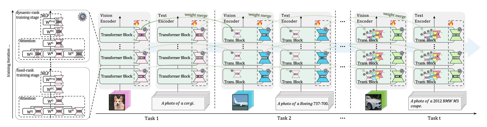

<h1 align="center">Take Only What You Need:<br>Rank Minimization as an Implicit Forgetting Regularizer in Continual Learning</h1>

<p align="center">
  <a href="https://artificer-ai-lab.github.io/CoDyRA/"></a>
  <a href="https://openreview.net/forum?id=TmGgXWnedq"></a>
  <a href="https://arxiv.org/abs/2412.01004"></a>
  <a href="LICENSE"></a>
</p>

<p align="center">
  <a href="https://jeff024.github.io/">Haodong Lu</a><sup>1,2</sup>,
  <a href="https://zhaoc5.github.io/">Chongyang Zhao</a><sup>1</sup>,
  <a href="https://minhui-xue.github.io/">Minhui Xue</a><sup>2</sup>,
  <a href="https://www.linayao.com/">Lina Yao</a><sup>1</sup>,
  <a href="https://people.csiro.au/m/k/kristen-moore">Kristen Moore</a><sup>2</sup>,
  <a href="https://donggong1.github.io/">Dong Gong</a><sup>1,*</sup>
</p>

<p align="center"><sup>1</sup>University of New South Wales &nbsp;&nbsp;<sup>2</sup>CSIRO</p>

> Official implementation of **CoDyRA** — **Co**ntinual **Dy**namic **R**ank-Selective LoR**A** (Findings of EMNLP 2026).

---

## TL;DR
Rank minimization on LoRA updates acts as an **implicit forgetting regularizer** in continual learning.

## Abstract

The central tension in continual learning (CL) is the trade-off between *plasticity* (acquiring new knowledge) and *stability* (retaining prior knowledge). We study how a pre-trained backbone can be continually updated to absorb new knowledge while preserving existing capabilities, via **capacity control**: regulating the **effective rank** of each parameter update, a per-step quantity directly controllable inside a LoRA update.

A controlled probe of LoRA rank and placement across modules and tasks reveals a consistent trade-off, with a moderate-rank sweet spot that varies by placement and task, leaving no universally optimal fixed rank; a formal bound links forgetting to update rank.

Building on these findings, we propose **Co**ntinual **Dy**namic **R**ank-Selective LoR**A** (**CoDyRA**), which jointly trains each LoRA update with rank minimization via sparsity-promoting regularization on per-component importance weights. The supervised objective drives $\color{purple}{\text{plasticity}}$; rank minimization regularizes $\color{green}{\text{forgetting}}$.

We show that rank minimization serves as an **implicit forgetting regularizer** in the CL regime, protecting general capability and prior-task knowledge simultaneously by controlling forgetting against the current model state. Across MTIL, X-TAIL, and TRACE (CLIP, LLaMA, Gemma), CoDyRA outperforms prior CL methods on new-knowledge learning and forgetting, achieving a strong plasticity–stability balance.

## Key Takeaways from Analyses

- **Takeaway 1:** LoRA placement is a $\color{purple}{\text{plasticity}}$ – $\color{green}{\text{stability}}$ lever: no single placement or rank simultaneously optimizes both across tasks.
- **Takeaway 2:** Rank governs the $\color{purple}{\text{plasticity}}$ – $\color{green}{\text{stability}}$ balance: $\color{purple}{\text{higher rank}}$ favors plasticity, $\color{green}{\text{lower rank}}$ favors stability. For a given level of task adaptation, forgetting is minimized at a moderate-rank sweet spot.
- **Takeaway 3:** The sweet-spot rank is not universal: its location varies systematically by module and by downstream task.
- (See more details in the [paper](https://arxiv.org/abs/2412.01004).)

## Overview of CoDyRA Methodology



CoDyRA reframes each LoRA update as a set of rank-1 components (vectors), each carrying a learnable importance weight $\mathbf{w}_i$: some components help the current task, while others distort the pre-trained model and cause forgetting. An $\ell_1$ penalty on the importance weights — applied through a soft-thresholding (proximal) update — drives the unnecessary components' importance to zero, effectively deleting them and pushing the effective rank down toward what the task actually needs. This makes CoDyRA a **capacity-controlled** method (as opposed to *model complementation* or *reference-constrained* CL): a single rank criterion regulates every update. After each task, the rank-pruned update merges into the backbone, adding no inference overhead.

**Key properties:**
- ✅ No past data, task IDs, or per-task modules — operates under a strict CL regime
- ✅ No inference overhead — updates merge into the backbone
- ✅ A single rank-based criterion drives $\color{purple}{\text{current-task learning}}$ while protecting $\color{green}{\text{general (pretrained) capability}}$ *and* $\color{green}{\text{prior-task knowledge}}$
- ✅ Fewest trainable parameters among baselines (4.4M vs 59.8M–129.6M)
- ✅ Smallest per-task update magnitude and cumulative parameter shift — while fixed-rank LoRA drifts near-linearly, CoDyRA stays low, directly evidencing less forgetting
- ✅ Lowest Forgetting (1.87% on X-TAIL) among distillation, modular, low-rank, and fixed-rank LoRA baselines

## Results

**5-shot MTIL** (CLIP ViT-B/16). Transfer / Average / Last accuracy (%).

| Method | Transfer | Average | Last |
|:---|:---:|:---:|:---:|
| MoE-Adapter† | 68.9 | 71.4 | 76.1 |
| RAIL-Primal† | 69.4 | 71.9 | 77.2 |
| ZSCL | 65.3 | 64.4 | 67.4 |
| **CoDyRA** | **70.1** | **73.3** | **78.0** |

**X-TAIL** (10 domains, CLIP ViT-B/16). Transfer / Average / Last accuracy (%).

| Method | Transfer | Average | Last |
|:---|:---:|:---:|:---:|
| MoE-Adapter | 56.0 | 63.0 | 70.5 |
| RAIL-Primal | 62.4 | 70.7 | 79.1 |
| **CoDyRA** | **63.2** | **71.3** | **79.2** |

**TRACE** (LLM continual learning, 8 tasks). Overall Performance (OP ↑) / Forgetting (↓).

| Backbone | Method | OP ↑ | Forgetting ↓ |
|:---|:---|:---:|:---:|
| LLaMA-2-7B-Chat | O-LoRA | 42.78 | 7.16 |
| | TreeLoRA | 43.52 | 3.46 |
| | **CoDyRA** | **43.82** | **3.25** |
| Gemma-2B-it | TreeLoRA | 33.41 | 8.50 |
| | **CoDyRA** | **33.96** | **7.94** |
| LLaMA-3-1B-Instruct | TreeLoRA | 36.14 | 7.36 |
| | **CoDyRA** | **37.46** | **5.11** |

CoDyRA trains only **4.4M** parameters and adds **no inference overhead** (updates merge into the backbone). Full per-domain tables, ablations, and analyses are in the [paper](https://arxiv.org/abs/2412.01004) and on the [project page](https://artificer-ai-lab.github.io/CoDyRA/).

## Quick Start

### 1. Environment
```bash
conda create -n codyra python=3.12 -y
conda activate codyra
# Install PyTorch that matches your CUDA setup, e.g.
pip install torch torchvision torchaudio --index-url https://download.pytorch.org/whl/cu124
# Install project dependencies
pip install -r requirements.txt
```

### 2. Data
- Set `--data_dir` to the root directory that should hold all benchmarks (Aircraft, Caltech101, DTD, EuroSAT, Oxford Flowers, Food-101, MNIST, Oxford Pets, Stanford Cars, SUN397).
- Please refer to the following guide for setting up datasets: [CoOp](https://github.com/KaiyangZhou/CoOp/blob/main/DATASETS.md)


## Running CoDyRA

```bash
bash runner_codyra.sh
```

## License
CoDyRA is released under the Apache License 2.0. See [`LICENSE`](LICENSE) for details.

## Citation

```bibtex
@inproceedings{lu2026take,
  title     = {Take Only What You Need: Rank Minimization as an Implicit Forgetting Regularizer in Continual Learning},
  author    = {Lu, Haodong and Zhao, Chongyang and Xue, Minhui and Yao, Lina and Moore, Kristen and Gong, Dong},
  booktitle = {Findings of the Association for Computational Linguistics: EMNLP 2026},
  year      = {2026},
  url       = {https://openreview.net/forum?id=TmGgXWnedq}
}
```

## Acknowledgement

Our repo benefits from [MoE-Adapters](https://github.com/JiazuoYu/MoE-Adapters4CL) and [RAIL](https://github.com/linghan1997/Regression-based-Analytic-Incremental-Learning). We thank them for their wonderful works.
